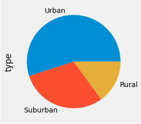
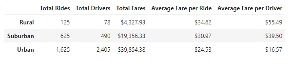
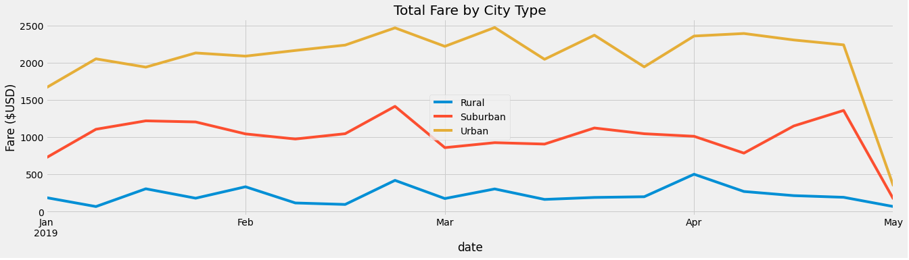

# PyBer Rideshare Analysis
Analysis of ride-sharing data by city-type using Pandas and Matplotlib libraries.

## Overview of the Analysis
The purpose of this analysis was to address disparities in ride-sharing data between three city types: urban, suburban, and rural. Using Python and Pandas, I created a summary dataframe of the data. Using Pandas and Matplotlib, I created a multiple-line graph that shows the total weekly fares for each city type. 

## Results of the Analysis
The initial analysis demonstrated that there is a wide disparity between the three types of cities. Unsurprisingly, there are many more riders in urban areas than in suburban or rural areas.  

The dataframe analysis showed: 
* Total rides are almost three times as high in urban as in suburban
* Total rides are thirteen times as high in urban as in rural
* Total drivers are almost five times as high in urban as in suburban
* Total divers are almost thirty-one times as high in urban as in rural
* Average fares per ride are somewhat higher in rural, then suburban, then urban
* However, average fares per driver are much lower in urban due to the glut of drivers

The final analysis of the total fare by city type between the months of January and April indicates a general upswing in fares until they drop precipitously in May. 

## Summary and Future Directions
Based on the analysis, some ways to reduce disparities between the city types are: 
* Provide incentives for drivers to make longer trips to and from rural areas
* Analyze for particularly busy times of day and provide incentives for drivers at those times
* Advertise more in urban areas in order to increase the number of riders